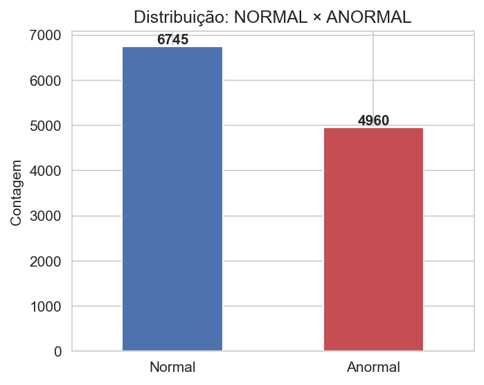
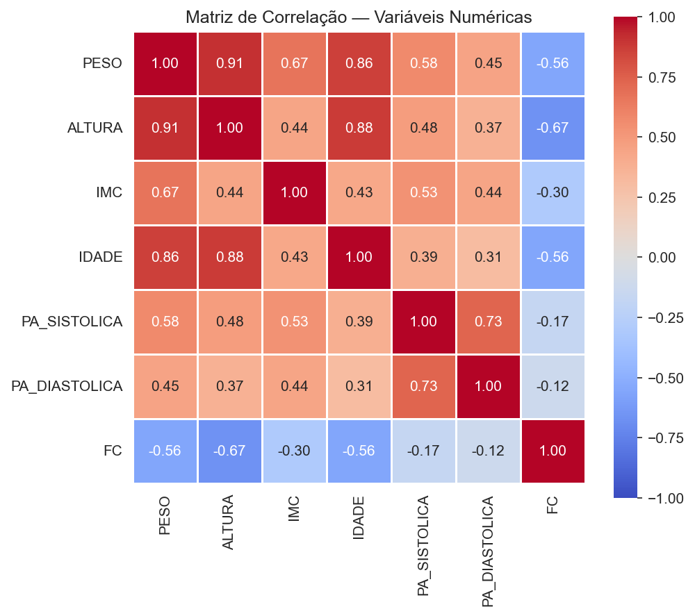
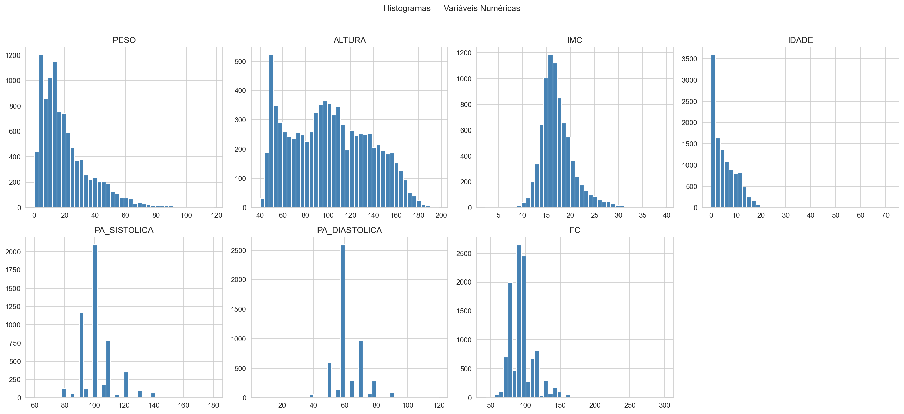
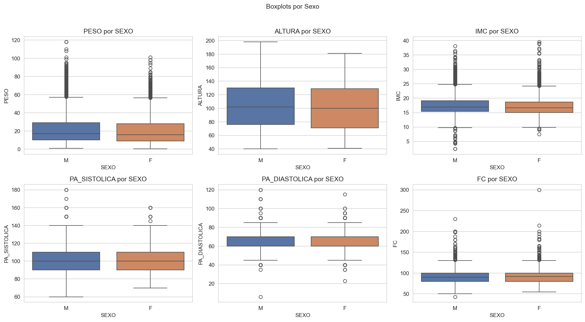
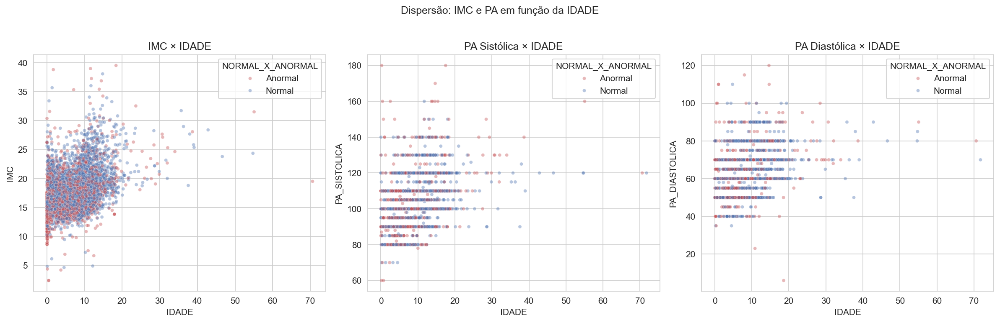
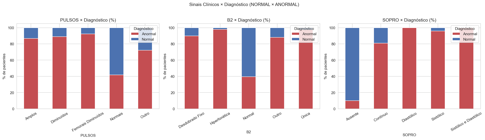
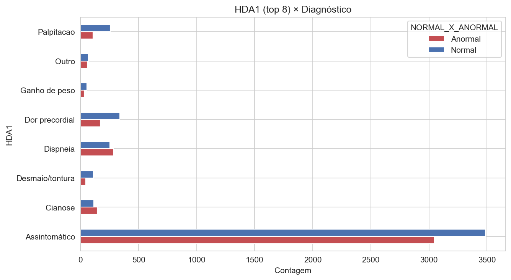
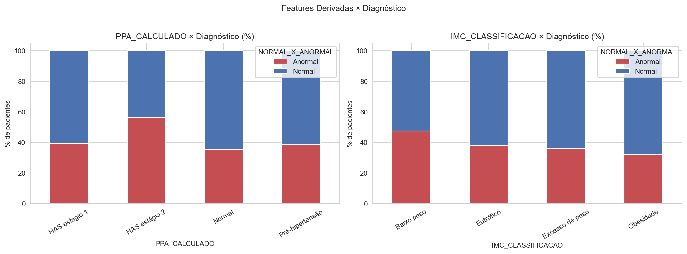

# Predição de Patologias Cardíacas em Crianças e Adolescentes (KDD)

Projeto de KDD (*Knowledge Discovery in Databases*) aplicado a dados de
pacientes pediátricos do **Real Hospital Português (RHP/UCMF)**, com o
objetivo de prever a variável `NORMAL_X_ANORMAL` (presença ou não de
patologia cardíaca) a partir de dados clínicos e antropométricos.

> **Status geral:** Limpeza, Feature Engineering e EDA concluídas e
> validadas. Modelagem ainda não iniciada (próxima etapa).

---

## Sumário

- [Objetivo](#objetivo)
- [Dataset](#dataset)
- [Estrutura do projeto](#estrutura-do-projeto)
- [Status por etapa](#status-por-etapa)
- [Etapa 1 — Limpeza dos Dados](#etapa-1--limpeza-dos-dados)
- [Etapa 2 — Engenharia de Atributos](#etapa-2--engenharia-de-atributos)
- [Etapa 3 — Análise Exploratória (EDA)](#etapa-3--análise-exploratória-eda)
- [Etapa 4 — Modelagem](#etapa-4--modelagem-não-iniciada)
- [Como rodar o pipeline](#como-rodar-o-pipeline)
- [Decisões metodológicas e ressalvas](#decisões-metodológicas-e-ressalvas)
- [Referências](#referências)

---

## Objetivo

Aplicar as etapas clássicas do processo de KDD — **Seleção → Pré-processamento
→ Transformação → Mineração → Interpretação/Avaliação** — sobre os dados do
RHP para gerar conhecimento e, ao final, um modelo preditivo capaz de
classificar um paciente pediátrico como `Normal` ou `Anormal` do ponto de
vista cardíaco, com base em dados de exame físico, antropometria e sinais
vitais.

## Dataset

Arquivo original: `data/raw/UCMF_raw.csv` — **12.873 linhas**, **21 colunas**
brutas (nunca editado diretamente).

Colunas originais: `ID, Peso, Altura, IMC, Atendimento, DN, IDADE, Convenio,
PULSOS, PA_SISTOLICA, PA_DIASTOLICA, PPA, NORMAL_X_ANORMAL, B2, SOPRO, FC,
HDA1, HDA2, SEXO, MOTIVO1, MOTIVO2`

Após limpeza e feature engineering, o dataset final (`UCMF_features.csv`)
possui **12.873 linhas × 35 colunas**.

## Estrutura do projeto

> Decisão do grupo: pipeline 100% em **scripts `.py`**, sem notebooks —
> mais simples de rodar e versionar via terminal/Git.

```
projeto-kdd-cardiaco/
├── README.md
├── requirements.txt
├── data/
│   ├── raw/
│   │   └── UCMF_raw.csv              # original, nunca editado
│   └── processed/
│       ├── UCMF_clean.csv            # saída da Etapa 1 (limpeza)
│       ├── limpeza_log.txt           # log completo da Etapa 1
│       └── UCMF_features.csv         # saída da Etapa 2 (features)
├── docs/
│   └── referencias/                  # PDFs/tabelas de apoio (IMC, PA etc.)
├── src/
│   ├── limpeza.py                    # ETAPA 1 ✅
│   ├── features.py                   # ETAPA 2 ✅
│   ├── referencias_clinicas.py       # tabelas clínicas de apoio à Etapa 2
│   ├── eda.py                        # ETAPA 3 ✅
│   └── modelagem.py                  # ETAPA 4 ⏳ não iniciada
└── reports/
    ├── figures/                      # 8 gráficos gerados pela EDA
    └── eda_summary.txt               # resumo textual da EDA
```

## Status por etapa

| Etapa | Script | Status |
|---|---|---|
| 1. Seleção e Limpeza | `src/limpeza.py` | ✅ Concluída e validada |
| 2. Engenharia de Atributos | `src/features.py` + `src/referencias_clinicas.py` | ✅ Concluída e validada |
| 3. Análise Exploratória (EDA) | `src/eda.py` | ✅ Concluída e validada |
| 4. Modelagem e Avaliação | `src/modelagem.py` | ⏳ Não iniciada (template vazio) |

---

## Etapa 1 — Limpeza dos Dados

Pipeline (`pipeline_limpeza()` em `src/limpeza.py`):

```
carregar_dataset → converter_datas → remover_duplicatas
→ limpar_numericas → limpar_categoricas
```

### Decisões de limpeza tomadas (e por quê)

| Regra | Critério | Registros afetados |
|---|---|---|
| Peso/Altura zerados | `PESO ≤ 0` ou `ALTURA ≤ 0` → `NaN` | — |
| Altura implausível | `ALTURA < 40cm` → `NaN` (erro de digitação tipo `"117"` lido como `"17"`) | 12 |
| IMC implausível (2ª camada) | `IMC_CALC > 40` → `PESO`, `ALTURA`, `IMC` → `NaN` (pega outliers de digitação que escapam do filtro de altura) | 11 (IMC máximo caiu de **847** para **39,54**) |
| Pressão arterial implausível | `PA > 250 mmHg` → `NaN` (erro de digitação tipo `"99"` lido como `"990"`) | 2 |
| PA invertida | `PAS < PAD` (fisiologicamente impossível) → `NaN` nos dois | 0 |
| Idade negativa | `IDADE < 0` → `NaN`, preenchida por `IDADE_CALC` quando possível | 1 preenchido |
| Idade fora do escopo pediátrico | `IDADE > 19` → flag `FLAG_IDADE_FORA_ESCOPO` (**mantido** no dataset, não removido) | 95 |
| FC fora da faixa fisiológica | `FC` fora de `30–300 bpm` → `NaN` | 14 |
| SEXO | Padronizado para `M` / `F` / `I` (indeterminado vira **categoria própria**, não `NaN`) | 4 não mapeados |
| IMC final | Sempre o **recalculado** (`IMC_CALC = PESO / ALTURA²`), nunca o valor informado no raw | — |

> ⚠️ Os mapas de padronização de `PULSOS`, `B2` e `SOPRO` cobrem **todas**
> as variações observadas no raw (confirmado via `value_counts()`). Se esses
> mapas forem editados no futuro, **sempre comparar contra o raw** antes de
> reportar "perda" de categorias — já houve confusão de versões no
> histórico do projeto.

### Resultado da Etapa 1

- **12.873 linhas, 30 colunas** na saída (`UCMF_clean.csv`).
- Duplicatas por `ID`: **0** removidas.
- 1.826 registros com `IDADE` inconsistente entre o valor informado e o
  calculado a partir de `DN`/`Atendimento` (flag `FLAG_IDADE_INCONSISTENTE`).

**Missings residuais conhecidos e aceitos como estruturais do dataset:**

| Coluna | Missing | % |
|---|---:|---:|
| PA_DIASTOLICA | 7.742 | 60,14% |
| PA_SISTOLICA | 7.732 | 60,06% |
| IMC / IMC_CALC | 4.858 | 37,74% |
| ALTURA | 4.483 | 34,82% |
| CONVENIO | 4.108 | 31,91% |
| PESO | 2.939 | 22,83% |
| FC | 1.898 | 14,74% |
| PULSOS | 1.194 | 9,28% |
| B2 | 1.178 | 9,15% |
| **NORMAL_X_ANORMAL (alvo)** | **1.168** | **9,07%** |
| SOPRO | 1.167 | 9,07% |
| SEXO | 4 | 0,03% |

A PA tem ~60% de missing porque nem todo paciente é aferido na consulta —
isso é estrutural do dataset, não um erro de coleta a corrigir.

---

## Etapa 2 — Engenharia de Atributos

Pipeline (`pipeline_features()` em `src/features.py`), apoiado nas tabelas
de `src/referencias_clinicas.py`. Adiciona 5 colunas novas, totalizando
**35 colunas** na saída (`UCMF_features.csv`).

### Features adicionadas

| Feature | Descrição |
|---|---|
| `PERCENTIL_IMC` | Percentil de IMC por idade/sexo (interpolado) |
| `IMC_CLASSIFICACAO` | `Baixo peso` / `Eutrófico` / `Excesso de peso` / `Obesidade` / `Não Calculado` |
| `PERCENTIL_ALTURA` | Percentil de estatura por idade/sexo (interpolado) |
| `PPA_CALCULADO` | `Normal` / `Pré-hipertensão` / `HAS estágio 1` / `HAS estágio 2` / `Não Calculado` |
| `FAIXA_ETARIA` | `0-2`, `2-5`, `5-12`, `12-19`, `19+ anos`, ou `Não Calculado` |

### Fontes e metodologia

- **Curvas de estatura e IMC por idade/sexo (2–20 anos):** digitalizadas
  *visualmente* a partir de gráficos da **DGS Portugal** fornecidos pelo
  professor. Margem de erro de leitura documentada no docstring de
  `referencias_clinicas.py`: **~1–2 cm** (estatura) / **~0,5 kg/m²** (IMC).
  Cortes oficiais de classificação de IMC: `< P85` Eutrófico, `P85–P95`
  Excesso de peso, `≥ P95` Obesidade (`< P5` tratado como Baixo peso por
  convenção pediátrica padrão).
- **Tabela de PA por idade/percentil de altura:** **NHBPEP/NHLBI** — *The
  Fourth Report on the Diagnosis, Evaluation, and Treatment of High Blood
  Pressure in Children and Adolescents* (Pediatrics 2004; 114(2): 555-576).
  Valores **exatos e oficiais**, fornecidos pelo professor em tabela (não
  estimados/digitalizados). Critério de classificação: usa-se o **maior**
  entre a classificação da sistólica e da diastólica (PAS *ou* PAD ≥
  percentil correspondente).
- **Validação:** a metodologia de cálculo de PPA e classificação de IMC foi
  conferida manualmente contra **2 exemplos resolvidos** enviados pelo
  professor em PDF — **bateram 100%**.

### Limitações conhecidas (documentadas no código, não são bugs)

- Bebês de **0–2 anos** sempre retornam `"Não Calculado"` em
  `IMC_CLASSIFICACAO` (as curvas DGS disponíveis só cobrem 2–20 anos; uma
  curva peso/comprimento 0–24 meses seria necessária e não foi
  disponibilizada).
- `SEXO = "I"` (indeterminado) sempre retorna `"Não Calculado"` em
  `PPA_CALCULADO` e `IMC_CLASSIFICACAO` (não há curva de referência própria
  para esse grupo).
- `PPA_CALCULADO` só é calculado para idades entre **1 e 17 anos** (faixa
  coberta pela tabela NHBPEP/NHLBI).

### Distribuição das novas features

```
IMC_CLASSIFICACAO          PPA_CALCULADO            FAIXA_ETARIA
Não Calculado   8208       Não Calculado  10291      0-2 anos     3755
Eutrófico       2510       Normal          2130      5-12 anos    3632
Obesidade       1217       HAS estágio 1    222      2-5 anos     2593
Excesso de peso  717       Pré-hipertensão  182      Não Calculado 1617
Baixo peso       221       HAS estágio 2     48      12-19 anos   1181
                                                      19+ anos       95
```

---

## Etapa 3 — Análise Exploratória (EDA)

Pipeline (`pipeline_eda()` em `src/eda.py`) — roda sobre `UCMF_features.csv`
e gera **8 figuras** em `reports/figures/` + um resumo textual em
`reports/eda_summary.txt`. Rodou sem erros; o dataset já está limpo (sem
outliers visíveis remanescentes).

### 1. Distribuição da variável-alvo

| Classe | Contagem | % |
|---|---:|---:|
| Normal | 6.745 | 52,40% |
| Anormal | 4.960 | 38,53% |
| NaN (sem rótulo) | 1.168 | 9,07% |

Classes razoavelmente balanceadas entre si (≈ 58% / 42% considerando só os
rótulos preenchidos) — não é um problema severo de desbalanceamento para a
etapa de modelagem.



### 2. Correlações entre variáveis numéricas

|  | PESO | ALTURA | IMC | IDADE | PA_SIS | PA_DIA | FC |
|---|---:|---:|---:|---:|---:|---:|---:|
| **PESO** | 1.00 | 0.91 | 0.67 | 0.86 | 0.58 | 0.45 | -0.56 |
| **ALTURA** | 0.91 | 1.00 | 0.44 | 0.88 | 0.48 | 0.37 | -0.67 |
| **IMC** | 0.67 | 0.44 | 1.00 | 0.43 | 0.53 | 0.44 | -0.30 |
| **IDADE** | 0.86 | 0.88 | 0.43 | 1.00 | 0.39 | 0.31 | -0.56 |
| **PA_SIS** | 0.58 | 0.48 | 0.53 | 0.39 | 1.00 | 0.73 | -0.17 |
| **PA_DIA** | 0.45 | 0.37 | 0.44 | 0.31 | 0.73 | 1.00 | -0.12 |
| **FC** | -0.56 | -0.67 | -0.30 | -0.56 | -0.17 | -0.12 | 1.00 |

Peso/Altura/Idade fortemente correlacionados entre si (esperado, crescimento
infantil). PA_SISTOLICA e PA_DIASTOLICA correlacionam **0,73** entre si —
fez sentido subir após o filtro de outliers de PA da Etapa 1. Possível
implicação para a modelagem: risco de **multicolinearidade** entre
PESO/ALTURA/IDADE se todas forem usadas como features.









### 3. Sinais clínicos × Diagnóstico

`SOPRO` é o **preditor categórico mais forte**:

| SOPRO | % Anormal | % Normal |
|---|---:|---:|
| Ausente | 9,9% | 90,1% |
| Contínuo | 80,9% | 19,1% |
| Sistólico | 95,9% | 4,1% |
| Diastólico | 100,0% | 0,0% |
| Sistólico e Diastólico | 100,0% | 0,0% |

`PULSOS` anormais (Amplos, Diminuídos, Femorais Diminuídos) fortemente
associados a Anormal (~87–92%), contra apenas 41,8% para `Pulsos Normais`.

`B2` anormal (Hiperfonética 98,0%, Única 97,4%) fortemente associado a
Anormal, contra 39,6% para `B2 Normal`.



### 4. HDA1 (motivo de consulta) × Diagnóstico

| HDA1 | Anormal | Normal |
|---|---:|---:|
| Assintomático | 3047 | 3486 |
| Cianose | 143 | 115 |
| Desmaio/tontura | 45 | 110 |
| Dispneia | 287 | 252 |
| Dor precordial | 169 | 338 |
| Ganho de peso | 31 | 56 |
| Outro | 57 | 67 |
| Palpitação | 106 | 256 |

`Cianose` e `Dispneia` proporcionalmente mais associados a Anormal;
`Desmaio/tontura`, `Dor precordial` e `Palpitação` mais associados a Normal
— consistente com a literatura (sintomas inespecíficos frequentemente não
indicam cardiopatia estrutural).



### 5. Features derivadas (PPA e IMC) × Diagnóstico

Relação **mais fraca** com o alvo do que os sinais clínicos de ausculta —
diferenças de apenas ~10–15 pontos percentuais entre categorias:

| PPA_CALCULADO | % Anormal |
|---|---:|
| HAS estágio 2 | 56,2% |
| Pré-hipertensão | 38,7% |
| HAS estágio 1 | 39,2% |
| Normal | 35,4% |

| IMC_CLASSIFICACAO | % Anormal |
|---|---:|
| Baixo peso | 47,6% |
| Eutrófico | 37,9% |
| Excesso de peso | 35,9% |
| Obesidade | 32,3% |

Resultado **esperado**: cardiopatia pediátrica neste contexto não é
primariamente definida por peso/PA, e sim pelos achados de ausculta
(`SOPRO`, `B2`, `PULSOS`).



---

## Etapa 4 — Modelagem (não iniciada)

`src/modelagem.py` ainda é um template vazio. Conforme o checklist original:

- [ ] Pré-processamento final: encoding de categóricas (provavelmente
      one-hot em `PULSOS`/`B2`/`SOPRO`/`SEXO`/`FAIXA_ETARIA`), descartar as
      linhas com `NORMAL_X_ANORMAL` NaN (alvo ausente), normalização de
      numéricas
- [ ] Split treino/teste (e validação cruzada)
- [ ] Treinar modelos: Árvore de Decisão, Random Forest, KNN, Naive Bayes,
      Regressão Logística — para prever `NORMAL_X_ANORMAL`
- [ ] Avaliar métricas: acurácia, precisão, recall, F1, matriz de confusão
- [ ] Comparar modelos e selecionar o melhor
- [ ] Interpretar *feature importance*

### Decisões em aberto antes de codificar

1. **Estratégia para PA (60% missing):** usar `PA_SISTOLICA`/
   `PA_DIASTOLICA` brutas com imputação, ou descartá-las e confiar apenas em
   `PPA_CALCULADO`? Decisão de modelagem ainda não tomada.
2. **Lista final de features:** candidatas prováveis — `PESO`, `ALTURA`,
   `IMC`, `IDADE`, `SEXO`, `PULSOS`, `B2`, `SOPRO`, `FC`,
   `PERCENTIL_ALTURA`, `PERCENTIL_IMC`, `FAIXA_ETARIA`. Excluir `HDA1`/
   `HDA2`, `MOTIVO1`/`MOTIVO2`, `CONVENIO` e colunas de texto livre/alta
   cardinalidade, a menos que se decida incluir HDA como categórica também.
3. **Linhas sem rótulo (1.168 registros com `NORMAL_X_ANORMAL` = NaN):**
   sempre excluídas do treino/teste — não há como treinar sem rótulo.
4. **Ordem de experimentação sugerida:** começar por Árvore de Decisão e
   Regressão Logística (simples, interpretáveis, fáceis de explicar na
   apresentação) antes de Random Forest/KNN — mas o checklist do README
   pede todos os modelos.

---

## Como rodar o pipeline

Ambiente: Python local (Windows/VSCode), `pandas`/`numpy`/`matplotlib`/
`seaborn` já instalados.

```bash
# Etapa 1 — Limpeza
python src/limpeza.py

# Etapa 2 — Feature Engineering (depende da Etapa 1)
python src/features.py

# Etapa 3 — EDA (depende da Etapa 2)
python src/eda.py

# Etapa 4 — Modelagem (depende da Etapa 3) — ainda não implementada
python src/modelagem.py
```

Cada script lê a saída da etapa anterior em `data/processed/` e não deve ser
rodado fora de ordem.

---

## Decisões metodológicas e ressalvas

- **`data/raw/UCMF_raw.csv` nunca é editado** — toda transformação acontece
  em `data/processed/`, preservando o dado original para auditoria.
- **IMC sempre recalculado** (`PESO / ALTURA²`) em vez de usar o valor
  informado no raw, por ser mais confiável e consistente.
- **Outliers tratados em duas camadas independentes** (altura mínima e IMC
  máximo) porque um erro de digitação em peso *ou* altura isoladamente pode
  não ser pego só pelo filtro de altura.
- **Flags em vez de remoção** para `IDADE > 19` — mantém o registro no
  dataset para decisão posterior (ex: filtrar ou não na modelagem),
  documentando a inconsistência sem perder dado.
- **Curvas de estatura/IMC (DGS) são leituras visuais de gráfico**, não
  valores tabelados oficiais — possuem margem de erro de leitura. Isso deve
  constar na seção de limitações do relatório final.
- **Tabela de PA (NHBPEP/NHLBI) é oficial e exata** — maior confiabilidade
  que as curvas DGS.
- Sempre que algo for editado em `limpeza.py` (especialmente os mapas de
  categóricas), **comparar contra o raw** antes de reportar "perda" de
  categorias — já houve confusão de versões no histórico do projeto.

---

## Referências

- NHBPEP/NHLBI — *The Fourth Report on the Diagnosis, Evaluation, and
  Treatment of High Blood Pressure in Children and Adolescents*. Pediatrics
  2004; 114(2): 555-576. (Tabelas de pressão arterial por idade/altura/sexo)
- DGS Portugal — Curvas de Estatura e IMC por idade/sexo (2–20 anos),
  Circular 05/DSMIA.
- Pinto Jr. et al. (2004) — incidência de cardiopatia congênita no Brasil.

---

## Divisão de tarefas (4 integrantes)

| Etapa | Responsável | Status |
|---|---|---|
| Seleção e Limpeza dos Dados | — | ✅ Concluída |
| Engenharia de Atributos | — | ✅ Concluída |
| Análise Exploratória (EDA) | — | ✅ Concluída |
| Modelagem e Avaliação | — | ⏳ Pendente |

### Etapas transversais (todos)
- [ ] Revisão do referencial teórico/clínico (intervalos de IDADE, IMC, PA
      usados na Etapa 2)
- [ ] Redação conjunta do relatório final (Introdução, Metodologia,
      Resultados, Conclusão) seguindo as etapas do KDD
- [ ] Revisão final e formatação

### Fluxo de trabalho no GitHub
1. Cada integrante trabalha em uma branch própria (`feature/limpeza`,
   `feature/feature-engineering`, `feature/eda`, `feature/modelagem`)
2. Scripts ficam em `/src`, nomeados por etapa
3. Ao concluir uma etapa: commit, push, abrir Pull Request para `main`
4. Atualizar este README marcando o checkbox correspondente e adicionando
   nome do responsável + data
5. Reunião rápida semanal para sincronizar dependências
