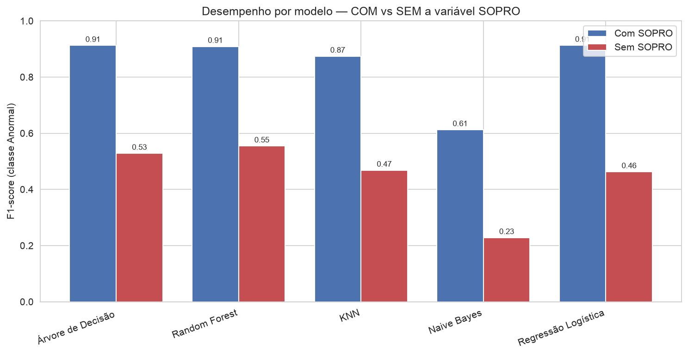
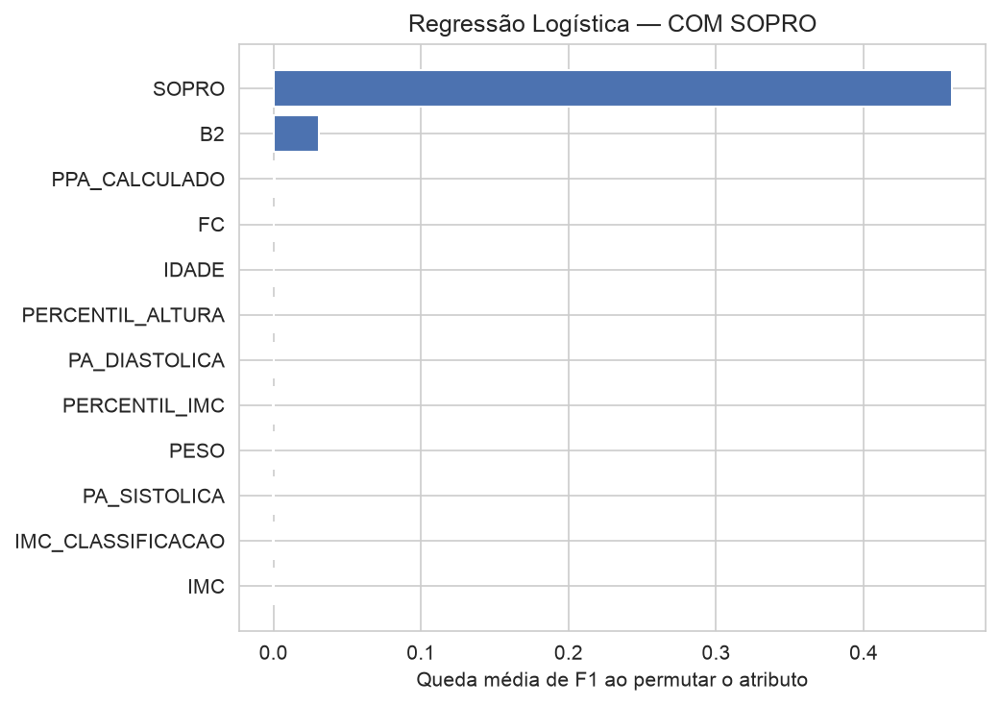
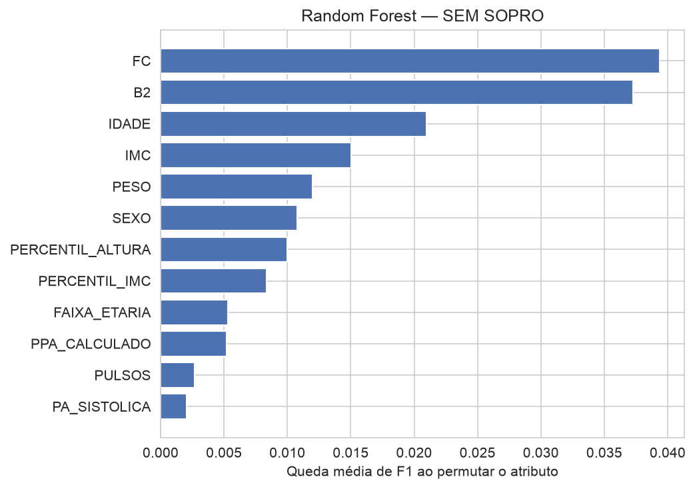

# Predição de Patologias Cardíacas em Crianças e Adolescentes
#### Relatório do Estudo de Caso — Processo de KDD

**Disciplina:** Mineração de Dados (Estudo de Caso 3) 
**Base de dados:** Real Hospital Português (RHP/UCMF), Recife-PE

**Integrantes:** 
Gabriel Henrique Ribeiro Amâncio 
Gabriel Nery da Silva Espindola 
José Eduardo Gontijo de Carvalho 
Pablo Agnaldo Marques Oliveira

Neste trabalho aplicamos o processo de KDD à base do Real Hospital Português, composta por 12.873 registros e 21 atributos originais, com o objetivo de prever a variável-alvo, que indica a ausência ou a presença de patologia cardíaca em pacientes de zero a dezenove anos, a partir de dados de exame físico, antropometria e sinais vitais.

## 1. Principais limpezas nos dados

A limpeza teve como prioridade corrigir erros de digitação e valores fisiologicamente implausíveis, sempre preservando o arquivo original e sem excluir registros, de modo a manter a base íntegra para a modelagem.

No campo da antropometria, pesos e alturas iguais ou inferiores a zero foram tratados como ausentes, assim como alturas abaixo de quarenta centímetros (doze casos, em geral dígitos perdidos, como o valor 117 registrado como 17). O índice de massa corporal foi sempre recalculado a partir do peso e da altura, em vez de se confiar no valor informado, e uma segunda verificação eliminou os índices recalculados acima de quarenta, o que reduziu o valor máximo de 847 para 39,5. Entre os sinais vitais, pressões arteriais acima de 250 e situações fisiologicamente impossíveis, em que a sistólica era menor que a diastólica, foram consideradas ausentes, o mesmo valendo para frequências cardíacas fora do intervalo de 30 a 300 batimentos por minuto. As idades negativas foram recalculadas com base nas datas de nascimento e de atendimento, e os 95 registros de pacientes com mais de dezenove anos foram sinalizados, embora mantidos. Por fim, as variáveis categóricas (sexo, pulsos, bulha B2, sopro e a própria variável-alvo) foram padronizadas, e não havia registros duplicados.

Cabe destacar que a elevada proporção de valores ausentes na pressão arterial (entre 56 e 60 por cento) e na antropometria (cerca de 34 por cento) não representa erro de coleta, e sim uma característica da base, já que nem todo paciente é aferido na consulta. Por essa razão, tais casos foram tratados por imputação na etapa de modelagem, e não por exclusão.

## 2. Principais transformações (engenharia de atributos)

A partir de referências de cardiologia e pediatria, foram criados cinco novos atributos clínicos, totalizando 35 colunas. O percentil de IMC e a respectiva classificação nutricional (baixo peso, eutrófico, excesso de peso ou obesidade) foram obtidos por idade e sexo, com base nas curvas de IMC de dois a vinte anos do material fornecido pelo professor. Para os cortes, adotou-se a convenção por percentil norte-americana (CDC), nos pontos 85 e 95, ressalvando-se que a referência oficial portuguesa e da Organização Mundial da Saúde emprega critério por escore-Z, o que pode deslocar alguns casos limítrofes. De maneira semelhante, calculou-se o percentil de estatura por idade e sexo. A classificação da pressão arterial (normal, pré-hipertensão, hipertensão estágio 1 ou estágio 2) seguiu a tabela oficial NHBPEP/NHLBI (Fourth Report, 2004) e foi conferida com dois exemplos resolvidos pelo professor, com correspondência integral. Criou-se, ainda, uma faixa etária com cortes clinicamente relevantes.

As transformações voltadas diretamente à modelagem consistiram em imputar os atributos numéricos pela mediana e padronizá-los, e em imputar os categóricos com uma categoria própria para valores ausentes, seguida de codificação binária (one-hot). Ao final, o modelo recebeu dezesseis atributos quando a variável sopro foi incluída e quinze quando ela foi retirada.

## 3. Modelos gerados

Foram treinados cinco classificadores clássicos de mineração de dados: Árvore de Decisão, Random Forest, KNN, Naive Bayes e Regressão Logística.

## 4. Pipeline utilizado

O trabalho seguiu as fases do processo de KDD, a saber, seleção, limpeza, transformação, mineração e avaliação. A etapa de mineração foi automatizada com as ferramentas Pipeline e ColumnTransformer da biblioteca scikit-learn, o que assegura que a imputação e a padronização sejam ajustadas apenas com os dados de treino, evitando o vazamento de informação. De início, descartaram-se os 1.168 registros sem rótulo, restando uma amostra supervisionada de 11.705 casos, dos quais 57,6 por cento são normais e 42,4 por cento anormais, proporção que não configura desbalanceamento severo. Em seguida, os dados foram divididos de forma estratificada, com 75 por cento para treino e 25 por cento para teste, mantendo-se exatamente a mesma divisão nos dois cenários, a fim de permitir uma comparação justa. Sobre o conjunto de treino aplicou-se validação cruzada estratificada de cinco partições para selecionar o melhor modelo, e o desempenho final foi medido no conjunto de teste reservado. Todo esse ciclo foi executado duas vezes, com e sem a variável sopro.

## 5. Métricas de avaliação (com e sem SOPRO)

A avaliação tomou a classe Anormal como classe positiva, por ser a clinicamente relevante de detectar, e empregou cinco métricas: acurácia, precisão, recall, F1 e área sob a curva ROC (AUC). As tabelas a seguir apresentam os resultados no conjunto de teste.

**Cenário A — com a variável SOPRO**

| Modelo | Acurácia | Precisão | Recall | F1 | AUC |
|---|---:|---:|---:|---:|---:|
| Árvore de Decisão | 0,929 | 0,957 | 0,873 | 0,913 | 0,938 |
| Random Forest | 0,926 | 0,944 | 0,877 | 0,909 | 0,944 |
| KNN | 0,902 | 0,955 | 0,807 | 0,875 | 0,931 |
| Naive Bayes | 0,756 | 0,938 | 0,455 | 0,613 | 0,926 |
| Regressão Logística (selecionado) | 0,929 | 0,952 | 0,877 | 0,913 | 0,947 |

**Cenário B — sem a variável SOPRO**

| Modelo | Acurácia | Precisão | Recall | F1 | AUC |
|---|---:|---:|---:|---:|---:|
| Árvore de Decisão | 0,663 | 0,649 | 0,446 | 0,529 | 0,700 |
| Random Forest (selecionado) | 0,656 | 0,614 | 0,506 | 0,555 | 0,691 |
| KNN | 0,622 | 0,579 | 0,394 | 0,469 | 0,639 |
| Naive Bayes | 0,624 | 0,872 | 0,131 | 0,229 | 0,654 |
| Regressão Logística | 0,649 | 0,657 | 0,357 | 0,463 | 0,680 |

Convém observar que, no cenário com sopro, a Regressão Logística, a Árvore de Decisão e o Random Forest ficaram tecnicamente empatados, com F1 médio na validação cruzada de 0,911, 0,909 e 0,907, respectivamente, diferenças que cabem dentro da margem de variação. A escolha recaiu sobre a Regressão Logística por ser o modelo mais simples e interpretável, além de apresentar a maior área sob a curva ROC e a menor variância. Cabe ainda uma ressalva sobre o Naive Bayes: seu F1 baixo decorre do limiar padrão de decisão aplicado a classes levemente desbalanceadas, e não de incapacidade de discriminação, tanto que sua área sob a curva ROC no cenário com sopro é de 0,926, comparável à dos melhores modelos.

O resultado mais importante surge da comparação entre os dois cenários: a remoção da variável sopro derruba o F1 do melhor modelo de cerca de 0,91 para cerca de 0,55, e a acurácia de 0,93 para 0,66. Em outras palavras, a ausculta, e em especial o sopro, concentra quase toda a capacidade preditiva, como ilustra a Figura 1.

<figure class="w55">

<figcaption>Figura 1. F1 da classe Anormal por modelo. A barra vermelha, referente ao cenário sem sopro, cai em todos os cinco classificadores, o que evidencia a dependência do sopro.</figcaption>
</figure>

## 6. Interpretação do melhor modelo

Entre os três modelos empatados, optamos pela Regressão Logística com sopro, novamente pela simplicidade e pela facilidade de interpretação, e não por superioridade numérica. Esse modelo alcançou acurácia de 0,929, precisão de 0,952, recall de 0,877, F1 de 0,913 e área sob a curva ROC de 0,947. Em sua matriz de confusão, calculada sobre os 2.927 casos de teste, ele classificou corretamente 1.632 pacientes normais e 1.088 anormais, cometendo apenas 55 falsos positivos e 152 falsos negativos.

A precisão de 0,95 indica pouquíssimos alarmes falsos, ao passo que o recall de 0,88 mostra que cerca de 12 por cento dos casos anormais ainda escapam, justamente os 152 falsos negativos. Esse é o erro mais sensível do ponto de vista clínico e o que se deveria reduzir em trabalhos futuros, por exemplo ajustando o limiar de decisão.

A análise de importância por permutação, apresentada nas Figuras 2a e 2b, confirma a leitura clínica. O sopro domina, com queda de F1 de aproximadamente 0,46 quando seus valores são embaralhados, seguido de longe pela bulha B2, enquanto antropometria, idade e pressão arterial têm peso marginal. Sem o sopro, o melhor modelo passa a apoiar-se na frequência cardíaca, na bulha B2 e na idade, sinais bastante mais fracos, o que explica a queda de desempenho. Vale uma ressalva clínica: a importância quase nula dos pulsos no modelo decorre de sua raridade na amostra (apenas 39 casos de pulsos femorais diminuídos e 18 de pulsos diminuídos) e da sobreposição com o sopro, e não de irrelevância clínica, pois, na análise exploratória, pulsos femorais diminuídos associaram-se a anormalidade em 92,3 por cento dos casos, permanecendo um sinal clássico de alerta para coarctação de aorta.

<figure>

<figcaption>Figura 2a. Melhor modelo com sopro: o sopro domina e os demais atributos têm peso próximo de zero.</figcaption>
</figure>
<figure>

<figcaption>Figura 2b. Melhor modelo sem sopro: frequência cardíaca, bulha B2 e idade assumem, com importâncias cerca de dez vezes menores.</figcaption>
</figure>

Em conclusão, o conhecimento extraído mostra-se coerente com a cardiologia pediátrica, pois o diagnóstico, neste contexto, é determinado essencialmente pelos achados de ausculta, e não pelo peso, pelo IMC ou pela pressão arterial. É preciso, no entanto, fazer uma ressalva metodológica importante. Como a base reúne pacientes já encaminhados à cardiologia, o sopro prediz tão bem em boa parte por viés de seleção e, além disso, a variável registra apenas o tipo de sopro, sem distinguir o sopro inocente do patológico. Num contexto de rastreio na população geral o quadro se inverteria, já que a maioria dos sopros sistólicos em crianças é inocente ou funcional, como o sopro de Still, de modo que esse poder preditivo não se transfere para fora do encaminhamento. É exatamente por isso que apresentar as métricas nas duas versões se mostra essencial, pois a versão sem sopro revela o quanto as demais variáveis realmente acrescentam. Como limitações, registram-se a leitura visual das curvas de IMC e de estatura, com erro aproximado de um a dois centímetros, a grande quantidade de pressões arteriais ausentes e o fato de o resultado valer apenas para a população já encaminhada, e não para rastreio.
